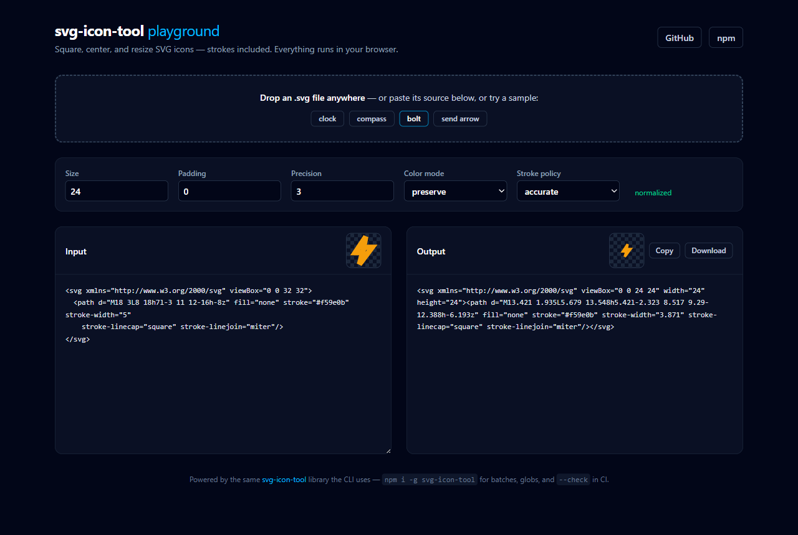
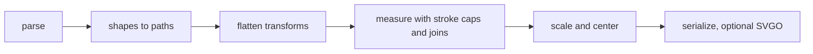

# svg-icon-tool

Normalize any SVG icon: square it, center it, resize it — strokes included.

[](https://github.com/jeeanribeiro/svg-icon-tool/actions/workflows/ci.yml)
[](https://www.npmjs.com/package/svg-icon-tool)
[](https://bundlephobia.com/package/svg-icon-tool)
[](LICENSE)

Icons arrive messy: off-center art in arbitrary view boxes, geometry hidden
inside transforms, strokes that clip at the edges. `svg-icon-tool` measures
what the icon actually paints — shape primitives, nested transforms, and
stroke caps, joins, and miters included — and rewrites it into a clean,
centered `0 0 N N` view box with proportionally scaled strokes.

**[Try it in your browser →](https://jeeanribeiro.github.io/svg-icon-tool/)**
— drop an icon on the playground, which runs this exact library:

[](https://jeeanribeiro.github.io/svg-icon-tool/)

Every "after" below is unedited output of the tool (generated by
[`scripts/build-assets.mjs`](scripts/build-assets.mjs)):

|                                               Before                                               |                                             After                                              | Command                                                                                                     |
| :------------------------------------------------------------------------------------------------: | :--------------------------------------------------------------------------------------------: | :---------------------------------------------------------------------------------------------------------- |
|        |      | `svg-icon-tool clock.svg out.svg` — `<circle>`/`<line>` primitives measured, stroke width scaled in step    |
|         |  | `svg-icon-tool compass.svg out.svg` — nested `translate·rotate·scale` flattened into the path data          |
|  |        | `svg-icon-tool bolt.svg out.svg --padding 1` — square caps and miter spikes measured exactly, nothing clips |
|          |          | `svg-icon-tool arrow.svg out.svg` — scaled up to fill the box, centered on the longest axis                 |

_(Table outputs use `--color-mode preserve` so the colors survive; the
default repaints everything with `currentColor` — see below.)_

## Features

- **Measures everything that paints** — `<path>`, `<rect>`, `<circle>`,
  `<ellipse>`, `<line>`, `<polyline>`, `<polygon>`; primitives are converted
  to paths so output is uniform.
- **Flattens transforms** — nested `translate` / `scale` / `rotate` /
  `skew` / `matrix` are multiplied out into the path data before measuring.
- **Stroke-exact bounds** — inherited `stroke-width` is resolved through
  groups, and the `accurate` policy accounts for square caps and miter
  spikes, so wide strokes never clip.
- **Proportional stroke scaling** — `stroke-width`, `stroke-dasharray`, and
  `stroke-dashoffset` scale with the geometry.
- **Honest about limits** — `<text>`, `<image>`, `<use>`, and hidden
  elements produce explicit warnings instead of silently wrong output.
- **Batch + CI ready** — glob inputs, `--out-dir`, stdin/stdout piping, and
  a `--check` mode that fails the build when icons drift.
- **Optional SVGO pass** — `--optimize` runs the result through
  [SVGO](https://github.com/svg/svgo) 4.

## Quickstart

```sh
# once (Node 24+)
npm install -g svg-icon-tool

# or ad hoc
npx svg-icon-tool icon.svg icon-24.svg
```

## CLI usage

```sh
# one file in, one file out (24x24 by default)
svg-icon-tool input.svg output.svg

# pipe: stdin -> stdout
cat raw.svg | svg-icon-tool - - > clean.svg

# batch a whole directory through a glob
svg-icon-tool "icons/**/*.svg" --out-dir normalized/

# 32px with a 2-unit margin, keeping the original colors, SVGO'd
svg-icon-tool icon.svg out.svg --size 32 --padding 2 --color-mode preserve --optimize
```

### Lint your icon set in CI

`--check` dry-runs the pipeline and exits `1` if any icon is not already
normalized — nothing is written. Add it next to your linter:

```sh
svg-icon-tool --check "src/icons/*.svg"
```

```
not normalized: src/icons/spinner.svg
1 of 12 icons needs attention (re-run without --check to fix)
```

### Options

| Option                     | Description                                                                                                                | Default        |
| :------------------------- | :------------------------------------------------------------------------------------------------------------------------- | :------------- |
| `-s, --size <number>`      | Target square size in user units                                                                                           | `24`           |
| `-p, --padding <number>`   | Margin kept on every side                                                                                                  | `0`            |
| `--precision <int>`        | Decimal places kept in coordinates                                                                                         | `3`            |
| `--color-mode <mode>`      | `currentColor` repaints every fill/stroke so icons follow the text color; `preserve` keeps paints untouched                | `currentColor` |
| `--stroke-policy <policy>` | `accurate` measures caps and miters exactly; `half` is the v2-compatible half-width guess; `ignore` measures geometry only | `accurate`     |
| `-o, --out-dir <dir>`      | Batch mode: write each input here                                                                                          | —              |
| `--optimize`               | Run the result through SVGO                                                                                                | off            |
| `--check`                  | Exit `1` if any icon would change; write nothing                                                                           | off            |
| `-q, --quiet`              | Suppress per-file progress messages                                                                                        | off            |

## Library usage

The CLI is a thin wrapper around a pure function you can import:

```ts
import { normalizeIcon, NormalizeError } from 'svg-icon-tool';

const { svg, changed, warnings } = normalizeIcon(rawSvg, {
  size: 24, // target square size
  padding: 0, // margin on every side
  precision: 3, // decimals kept in coordinates
  colorMode: 'currentColor', // or 'preserve'
  strokePolicy: 'accurate', // or 'half' | 'ignore'
});
```

- `svg` — the normalized document.
- `changed` — `false` when the input was already normalized (this powers
  `--check`).
- `warnings` — human-readable notes about unsupported or skipped content.
- Throws `NormalizeError` when the input is not usable SVG or nothing
  measurable remains.

Ships ESM + CJS with TypeScript types; no DOM required, runs anywhere Node
runs.

## How it works



Design notes:

- **One coordinate space.** Every element's accumulated transform is
  multiplied into its path data first, so measuring and rewriting agree by
  construction. Non-uniform transforms over strokes are approximated (with a
  warning) since a skewed stroke is no longer a uniform band.
- **Stroke math, not guesswork.** The geometric bounds grow by half the
  stroke width (exact for round/butt caps and round/bevel joins), plus the
  exact corner points of square caps and the exact tips of miter joins
  within the miter limit.
- **Strokes land resolved on leaves.** Inherited stroke lengths are resolved
  and rescaled per element, so output never depends on ancestor values the
  tool cannot scale. A `stroke-width` with no stroke paint is dropped — it
  paints nothing.
- **Warnings over silence.** Unsupported content (`<text>`, `<image>`,
  `<use>`, CSS `<style>`) is left in place but excluded from measurement,
  and the tool says so on stderr.

## Development

```sh
pnpm install
pnpm build      # tsup -> dist/ (ESM + CJS + d.ts + CLI)
pnpm test       # vitest fixture + snapshot suite
pnpm lint       # eslint (typed) + prettier
pnpm typecheck  # tsc --noEmit
pnpm assets     # regenerate docs/assets via the built CLI
```

The [playground](https://jeeanribeiro.github.io/svg-icon-tool/) lives in
`playground/` and bundles the library straight from `src/`:

```sh
pnpm playground:dev    # local dev server
pnpm playground:build  # static build (deployed to Pages from main)
```

## Roadmap

- Resolve `<use>` references and inline `<style>` rules before measuring.
- Pixel-diff regression tests via resvg.

## Contributing

Issues and PRs are welcome — see [CONTRIBUTING.md](CONTRIBUTING.md).

## License

[MIT](LICENSE) © Jean Ribeiro
